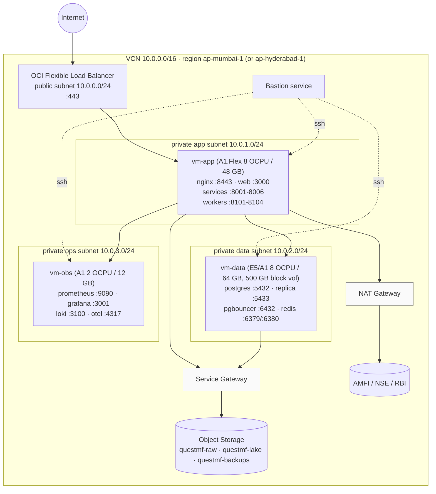
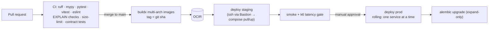

# quest-mf — Deployment on Oracle Cloud Infrastructure (OCI)

**Parent:** [HLD](HLD.md)
**Phase 1:** Docker Compose on OCI Compute VMs · **Phase 2:** OKE (Kubernetes)

---

## 1. Port registry (single source of truth)

> Changing a port means updating **this table**, `infra/compose/.env`, the Nginx upstreams, the OCI security lists, and the Vite dev proxy, all in the same PR.

| Component | Port | Protocol | Exposed to | Health |
|---|---|---|---|---|
| OCI Load Balancer | 443 (80 → 301) | HTTPS | Internet | — |
| Nginx edge | 8443 (TLS from LB) / 8080 | HTTP(S) | LB only | `/nginx-health` |
| `web` (static) | **3000** | HTTP | Nginx | `/` |
| `auth-service` | **8001** | HTTP | Nginx | `/healthz` |
| `fund-service` | **8002** | HTTP | Nginx | `/healthz` |
| `market-data-service` | **8003** | HTTP | Nginx | `/healthz` |
| `analytics-service` | **8004** | HTTP | Nginx | `/healthz` |
| `screener-service` | **8005** | HTTP | Nginx | `/healthz` |
| `backtest-service` | **8006** | HTTP | Nginx | `/healthz` |
| `ingestion-worker` | **8101** | HTTP (health/metrics) | Prometheus | `/healthz` |
| `compute-worker` | **8102** | HTTP (health/metrics) | Prometheus | `/healthz` |
| `backtest-worker` | **8103** | HTTP (health/metrics) | Prometheus | `/healthz` |
| `scheduler` | **8104** | HTTP (health/metrics) | Prometheus | `/healthz` |
| PostgreSQL primary | **5432** | TCP | data subnet only | `pg_isready` |
| PostgreSQL replica | **5433** | TCP | data subnet only | `pg_isready` |
| PgBouncer | **6432** | TCP | app subnet | `SHOW POOLS` |
| Redis (cache) | **6379** | TCP | app subnet | `PING` |
| Redis (streams) | **6380** | TCP | app subnet | `PING` |
| Prometheus | **9090** | HTTP | bastion / VPN | `/-/ready` |
| Grafana | **3001** | HTTP | bastion / VPN (or Nginx `/grafana` with auth) | `/api/health` |
| Loki | **3100** | HTTP | app subnet | `/ready` |
| OTel Collector | **4317** (gRPC) / **4318** (HTTP) | — | app subnet | — |
| node_exporter | **9100** | HTTP | Prometheus | — |
| postgres_exporter | **9187** | HTTP | Prometheus | — |
| redis_exporter | **9121** | HTTP | Prometheus | — |

## 2. Network topology



> In production the replica should be on its own VM (`vm-data-2`). It is shown co-located only for the minimal footprint.

### 2.1 Security lists / NSGs

| NSG | Ingress | From |
|---|---|---|
| `nsg-lb` | 443, 80 | 0.0.0.0/0 |
| `nsg-app` | 8443, 8080 | `nsg-lb` |
| `nsg-app` | 3000, 8001–8006 | `nsg-app` (Nginx is on the same host; also allows scale-out to multiple app VMs) |
| `nsg-app` | 8101–8104, 9100 | `nsg-obs` |
| `nsg-data` | 5432, 5433, 6432, 6379, 6380 | `nsg-app` |
| `nsg-data` | 9187, 9121, 9100 | `nsg-obs` |
| `nsg-obs` | 3100, 4317, 4318 | `nsg-app`, `nsg-data` |
| `nsg-obs` | 3001, 9090 | Bastion / VPN CIDR only |
| all | 22 | OCI Bastion only |

**Never** expose 5432/6432/6379 to the internet. Egress goes through the NAT Gateway (external sources) and the Service Gateway (Object Storage, OCIR, Vault).

## 3. OCI services used

| Need | OCI service |
|---|---|
| Compute | VM.Standard.A1.Flex (arm64) / E5.Flex |
| Load balancing + TLS | Flexible Load Balancer (certificate via OCI Certificates) |
| Container images | OCIR (`<region>.ocir.io/<tenancy>/questmf/<service>:<git-sha>`) |
| Secrets | OCI Vault (DB passwords, JWT private key, Redis password) |
| Object storage | Buckets `questmf-raw` (versioned), `questmf-lake`, `questmf-backups` (lifecycle → Archive) |
| Block storage | 500 GB Balanced (Higher Performance for the WAL volume) |
| DNS | OCI DNS zone (or external) |
| Access | OCI Bastion (no public SSH) |
| Monitoring (optional) | OCI Monitoring alarms on VM health in addition to Prometheus |
| IaC | Terraform (OCI provider) in `infra/oci/terraform` |

## 4. Nginx edge configuration (excerpt)

```nginx
worker_processes auto;
events { worker_connections 4096; multi_accept on; }

http {
  sendfile on; tcp_nopush on; tcp_nodelay on;
  keepalive_timeout 65;
  brotli on; brotli_comp_level 5; brotli_types application/json text/css application/javascript image/svg+xml;
  gzip on; gzip_types application/json text/css application/javascript;

  proxy_cache_path /var/cache/nginx/micro levels=1:2 keys_zone=micro:50m max_size=1g inactive=10m;
  limit_req_zone $binary_remote_addr zone=perip:20m rate=30r/s;
  limit_req_zone $binary_remote_addr zone=auth:10m  rate=5r/m;

  upstream web        { server 127.0.0.1:3000; keepalive 32; }
  upstream auth       { server 127.0.0.1:8001; keepalive 32; }
  upstream funds      { server 127.0.0.1:8002; keepalive 64; }
  upstream market     { server 127.0.0.1:8003; keepalive 64; }
  upstream analytics  { server 127.0.0.1:8004; keepalive 64; }
  upstream screener   { server 127.0.0.1:8005; keepalive 128; }
  upstream backtests  { server 127.0.0.1:8006; keepalive 32; }

  server {
    listen 8443 ssl;
    http2 on;
    server_name questmf.example.com;
    ssl_certificate     /etc/nginx/tls/fullchain.pem;
    ssl_certificate_key /etc/nginx/tls/privkey.pem;

    add_header X-Content-Type-Options nosniff always;
    add_header Referrer-Policy strict-origin-when-cross-origin always;
    add_header Strict-Transport-Security "max-age=31536000" always;
    add_header Content-Security-Policy "default-src 'self'; img-src 'self' data:; style-src 'self' 'unsafe-inline'; connect-src 'self'" always;

    proxy_http_version 1.1;
    proxy_set_header Connection "";
    proxy_set_header Host $host;
    proxy_set_header X-Request-ID $request_id;
    proxy_set_header X-Forwarded-For $proxy_add_x_forwarded_for;
    proxy_set_header X-Forwarded-Proto https;
    proxy_connect_timeout 2s;
    proxy_read_timeout 10s;

    location /api/auth/      { limit_req zone=auth burst=5 nodelay; proxy_pass http://auth; }
    location /api/funds/     { limit_req zone=perip burst=60; proxy_pass http://funds; }
    location /api/market/    { limit_req zone=perip burst=60; proxy_pass http://market; }
    location /api/analytics/ { limit_req zone=perip burst=60; proxy_pass http://analytics; }

    location /api/screener/ {
      limit_req zone=perip burst=60;
      proxy_cache micro;
      proxy_cache_key "$request_uri|$http_authorization";
      proxy_cache_valid 200 5s;
      proxy_cache_lock on;
      proxy_cache_use_stale updating error timeout;
      proxy_pass http://screener;
    }

    location ~ ^/api/backtests/v1/runs/\d+/events$ {       # SSE
      proxy_buffering off; proxy_cache off;
      proxy_read_timeout 1h;
      proxy_pass http://backtests;
    }
    location /api/backtests/ { limit_req zone=perip burst=20; proxy_pass http://backtests; }

    location /assets/ {
      proxy_pass http://web;
      expires 1y; add_header Cache-Control "public, immutable";
    }
    location / { proxy_pass http://web; add_header Cache-Control "no-cache"; }
  }

  server { listen 8080; location /nginx-health { return 200 "ok"; } }
}
```

## 5. Docker Compose (phase 1)

Files live in `infra/compose/`: `compose.app.yml` (vm-app), `compose.data.yml` (vm-data) and `compose.obs.yml` (vm-obs).

```yaml
# compose.app.yml (excerpt)
x-api: &api
  restart: unless-stopped
  env_file: .env.app
  network_mode: host            # lowest latency on a single host; ports come from the registry
  logging: { driver: json-file, options: { max-size: "20m", max-file: "5" } }
  deploy: { resources: { limits: { memory: 1g } } }

services:
  nginx:
    image: ${REG}/questmf/nginx:${TAG}
    network_mode: host
    restart: unless-stopped
    volumes: [ "/etc/questmf/tls:/etc/nginx/tls:ro" ]
  web:               { <<: *api, image: "${REG}/questmf/web:${TAG}" }                 # :3000
  auth-service:      { <<: *api, image: "${REG}/questmf/auth-service:${TAG}",      environment: { QMF_PORT: 8001 } }
  fund-service:      { <<: *api, image: "${REG}/questmf/fund-service:${TAG}",      environment: { QMF_PORT: 8002 } }
  market-data-service: { <<: *api, image: "${REG}/questmf/market-data-service:${TAG}", environment: { QMF_PORT: 8003 } }
  analytics-service: { <<: *api, image: "${REG}/questmf/analytics-service:${TAG}", environment: { QMF_PORT: 8004 } }
  screener-service:  { <<: *api, image: "${REG}/questmf/screener-service:${TAG}",  environment: { QMF_PORT: 8005 } }
  backtest-service:  { <<: *api, image: "${REG}/questmf/backtest-service:${TAG}",  environment: { QMF_PORT: 8006 } }
  scheduler:         { <<: *api, image: "${REG}/questmf/scheduler:${TAG}",         environment: { QMF_PORT: 8104 } }
  ingestion-worker:  { <<: *api, image: "${REG}/questmf/ingestion-worker:${TAG}",  environment: { QMF_PORT: 8101 } }
  compute-worker:
    <<: *api
    image: ${REG}/questmf/compute-worker:${TAG}
    environment: { QMF_PORT: 8102, POLARS_MAX_THREADS: 4 }
    deploy: { resources: { limits: { memory: 16g, cpus: "4" } } }
  backtest-worker:
    <<: *api
    image: ${REG}/questmf/backtest-worker:${TAG}
    environment: { QMF_PORT: 8103 }
    deploy: { resources: { limits: { memory: 8g, cpus: "2" } } }
```

```yaml
# compose.data.yml (excerpt)
services:
  postgres:
    image: timescale/timescaledb-ha:pg16          # pin an exact tag in the real file
    ports: ["10.0.2.10:5432:5432"]
    volumes: ["/data/pg:/home/postgres/pgdata", "./postgresql.conf:/etc/postgresql/postgresql.conf:ro"]
    environment: { POSTGRES_PASSWORD_FILE: /run/secrets/pg_pw }
    shm_size: 4g
  pgbouncer:
    image: bitnami/pgbouncer:latest               # pin
    ports: ["10.0.2.10:6432:6432"]
  redis-cache:
    image: redis:7-alpine
    command: ["redis-server","--port","6379","--maxmemory","6gb","--maxmemory-policy","allkeys-lru","--requirepass","${REDIS_PW}"]
    ports: ["10.0.2.10:6379:6379"]
  redis-streams:
    image: redis:7-alpine
    command: ["redis-server","--port","6380","--appendonly","yes","--appendfsync","everysec","--maxmemory-policy","noeviction","--requirepass","${REDIS_PW}"]
    ports: ["10.0.2.10:6380:6380"]
    volumes: ["/data/redis-streams:/data"]
```

Bind data ports to the **private IP only** (`10.0.2.10:…`), never `0.0.0.0`.

## 6. CI/CD (GitHub Actions → OCIR → VMs)



Rules:
- Migrations follow **expand → migrate → contract**, so no deploy ever needs downtime.
- Deploys pull an immutable `TAG=<git-sha>`. Rollback = redeploy the previous tag.
- The DB migration job runs **before** the new services start, and its schema changes must be backward-compatible with the previous release.

## 7. Phase 2 — OKE

| Concern | Setting |
|---|---|
| Ingress | OCI Native Ingress Controller or ingress-nginx behind OCI LB |
| Read services | Deployment + HPA (CPU 60 %, min 2) |
| Workers | Deployment + **KEDA** Redis Streams scaler (pending entries) |
| Scheduler | 1 replica (plus the leader lock anyway) |
| Data | Stays on VMs (or moves to a managed service after evaluation) |
| Secrets | OCI Vault via the Secrets Store CSI driver |
| Ports | Container ports **unchanged** from §1; Services map to the same numbers |

## 8. Runbooks (short form)

| Situation | Steps |
|---|---|
| Nightly NAV missing | Check `/api/market/v1/freshness` → scheduler logs → `ops.ingest_log` → re-emit `jobs.ingest` with `XADD` → if AMFI is down, the morning retry covers it |
| Screener slow | Grafana "read path" dashboard → Redis hit ratio → `pg_stat_statements` top queries → confirm Q1 is an index-only scan → check that the replica lag is < 5 s |
| Compute failed mid-way | The snapshot stays `BUILDING`, readers keep the previous version → fix → re-emit `jobs.compute {as_of}` (idempotent) |
| DB primary lost | Promote the replica (`pg_ctl promote`) → update the PgBouncer target → restore a new replica from pgBackRest |
| Disk > 80 % | Run the compression job, archive old backtests, then expand the block volume online |
| Rollback | `TAG=<prev> docker compose -f compose.app.yml up -d <service>` |
