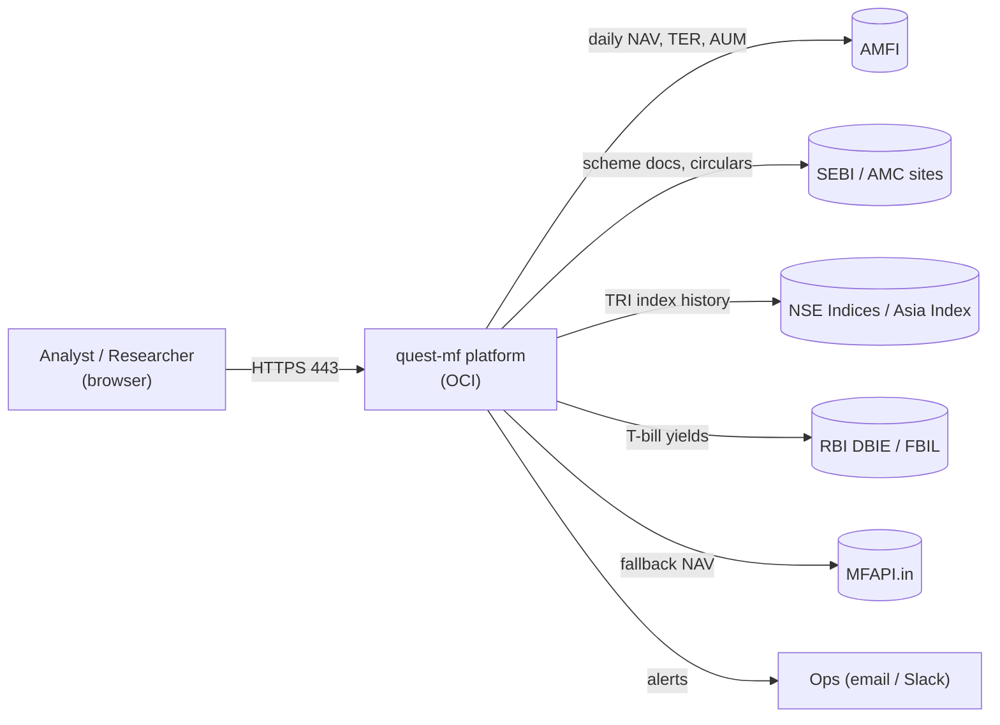
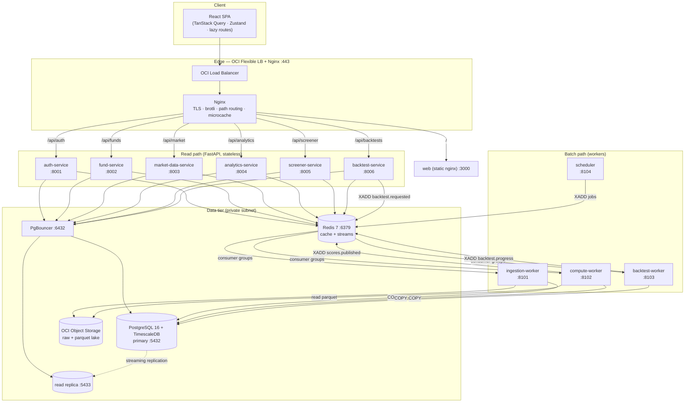
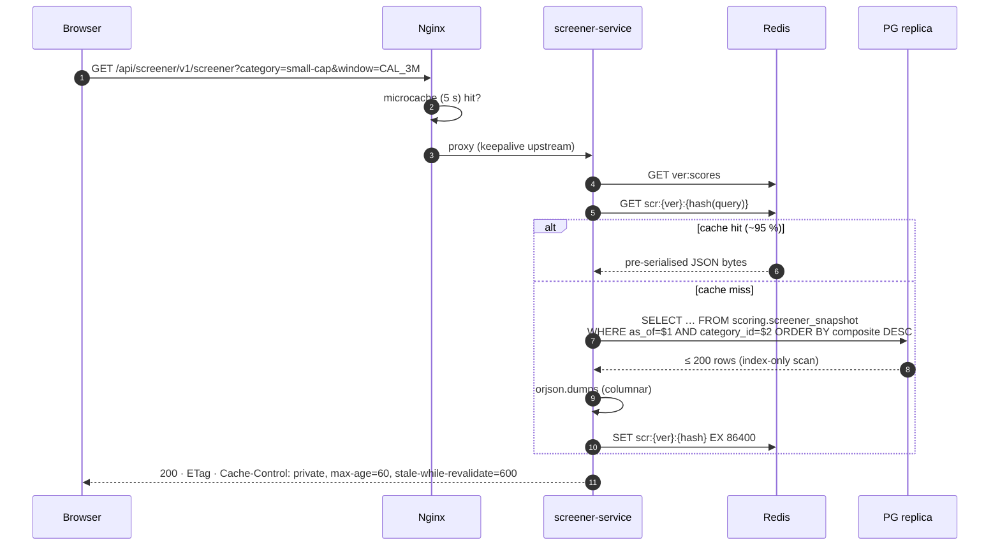
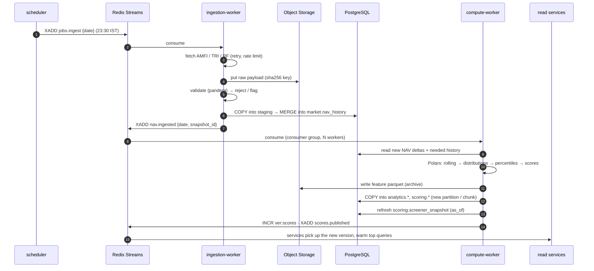
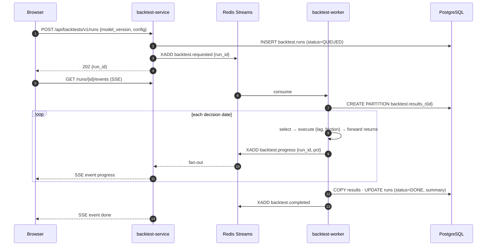

# quest-mf — High-Level Design (HLD)

**Status:** v1.0 · 17 Sep 2026
**Read with:** [LLD-backend](LLD-backend.md) · [LLD-database](LLD-database.md) · [LLD-frontend](LLD-frontend.md) · [DEPLOYMENT-OCI](DEPLOYMENT-OCI.md) · [Product spec v2](../mf_quant_screener_spec_v2.md) · [UI design system](../DESIGN.md) · [Agent rules](../../AGENTS.md)

> This HLD **supersedes** spec v2 §21 (storage engine), §24 (stack) and §25 (repo layout). Everything else in spec v2 (quant rules, formulas, tests) still applies.

---

## 1. Goals and non-functional requirements

| # | Requirement | Target |
|---|---|---|
| N1 | **Low latency** — screener API | p50 ≤ 15 ms (cache hit), p95 ≤ 80 ms, p99 ≤ 200 ms |
| N2 | Fund detail API (all panels) | p95 ≤ 120 ms per call |
| N3 | Chart series API (≤ 2,000 points) | p95 ≤ 150 ms |
| N4 | Frontend | First load LCP ≤ 1.5 s on 4G; route change ≤ 200 ms; initial JS ≤ 150 KB gzip |
| N5 | **Scale** | ≥ **1 billion** rows in the largest tables with no API regression |
| N6 | Nightly compute | Incremental run ≤ 15 min; full rebuild ≤ 3 h |
| N7 | Availability (MVP) | 99.5 % for the read path; the batch path may lag |
| N8 | Reproducibility | Same `data_snapshot_id` + `model_version` → identical scores |
| N9 | Security | Private data tier, TLS at the edge, JWT auth, secrets in OCI Vault |
| N10 | Cost | MVP runs on 3 OCI VMs (Ampere A1 capable) |

## 2. Key architectural decisions

| ID | Decision | Why | Rejected alternative |
|---|---|---|---|
| D1 | **Precompute everything; the API only reads** | Latency. The quant math (rolling windows, percentiles, scores) runs in batch workers. The read services never compute on request. | On-the-fly computation (too slow at 1B rows) |
| D2 | **PostgreSQL 16 + TimescaleDB** as the primary store | Time-series hypertables, chunk pruning, ~90 % columnar compression, SQL window functions, joins across fund metadata, ACID for financial data | **MongoDB**: time-series collections exist, but it is weaker for relational metadata, point-in-time joins and percentile SQL, and runs two query models |
| D3 | **Redis 7** for cache and event bus (Redis Streams) | One component gives sub-ms cache hits and durable consumer groups | Kafka (too heavy for MVP; OCI Streaming is the upgrade path) |
| D4 | **Microservices by bounded context**, each FastAPI app on its **own port** | Independent deploy and scale; the heavy backtest never blocks reads | A monolith (acceptable, but the user prefers microservices) |
| D5 | **One network hop**: Nginx routes by path directly to services | Every extra hop adds latency | A Python API gateway (adds 2–5 ms per request and another failure point) |
| D6 | **Schema-per-service** in one Postgres cluster, with a DB role per service | Keeps ownership boundaries without running 6 databases | Database-per-service (too much ops for MVP) |
| D7 | **Polars + DuckDB** inside compute workers; bulk load via binary `COPY` | Vectorised math; ~1M rows/s ingestion | ORM inserts (100× slower) |
| D8 | **Parquet on OCI Object Storage** as the lake (raw + features archive) | Cheap, replayable, used for rebuilds and archiving old backtests | Keeping everything hot in Postgres |
| D9 | **Versioned cache keys** instead of cache deletion | A compute run bumps `ver:*`, so stale keys simply stop being read, with no stampede | `DEL` pattern scans |
| D10 | **React + TS + Vite**, TanStack Query (server state), Zustand (UI state), lazy routes, virtualised tables, shadcn/ui + Tailwind v4 (matches DESIGN.md) | Speed, small bundles, a component-first codebase | Redux (boilerplate), Next.js SSR (not needed for an authenticated dashboard) |
| D11 | **Python venv** (`backend/.venv`) for local development; each service image installs only its own deps | User requirement; simple | Poetry/uv (can be adopted later) |
| D12 | Deploy on **OCI**: Docker Compose on VMs (phase 1) → OKE (phase 2) | Fast to start, clear upgrade path | Kubernetes on day 1 |

## 3. System context

## 4. Container architecture

### 4.1 Service catalogue

| Service | Port | Bounded context | Owns DB schema | Reads | Scales by |
|---|---|---|---|---|---|
| `web` | 3000 | UI static assets | — | — | CDN / nginx replicas |
| `auth-service` | 8001 | Users, sessions, JWT | `auth` | — | replicas |
| `fund-service` | 8002 | Scheme master, categories, events, costs, search | `ref` | — | replicas |
| `market-data-service` | 8003 | NAV, benchmark TRI, risk-free series (downsampled) | `market` | `ref` | replicas + replica DB |
| `analytics-service` | 8004 | Rolling metrics, distributions, risk, net-return calculator | `analytics` | `ref`, `market` | replicas |
| `screener-service` | 8005 | Scores, screener snapshots, 2×2 matrix | `scoring` | `ref` | replicas + Redis |
| `backtest-service` | 8006 | Backtest runs (CRUD), results, SSE progress | `backtest` | `scoring` | replicas |
| `ingestion-worker` | 8101* | Fetch → validate → store raw → load | `market`, `ref` (write) | — | 1 (scheduled) |
| `compute-worker` | 8102* | Rolling engine, distributions, percentiles, scoring | `analytics`, `scoring` (write) | `market`, `ref` | N consumers (partitioned by portfolio) |
| `backtest-worker` | 8103* | Walk-forward simulations | `backtest` (write) | all | N consumers |
| `scheduler` | 8104* | Cron triggers → job events | — | — | 1 (leader lock) |

\* Worker ports expose only `/healthz`, `/readyz` and `/metrics`.

**Rule:** a service **writes only its own schema**. Read services may read other schemas through **read-only DB roles and views** (a deliberate latency trade-off, see D6), never through each other's tables directly by joining in application code across HTTP.

## 5. Core flows

### 5.1 Screener request (hot path)

Latency budget (p95): Nginx 1 ms, Redis 1 ms, **miss path** PG 15–40 ms, serialisation 2 ms, network RTT (India → OCI Mumbai/Hyderabad) 20–40 ms.

### 5.2 Nightly pipeline

### 5.3 Backtest (async, long-running)

## 6. Low-latency design — the full list

**Backend**
1. Precompute all features and scores (D1). Request handlers are `SELECT` + serialise only.
2. Denormalised read tables (`scoring.screener_snapshot`, `analytics.fund_summary`). One row per fund, no joins at request time.
3. Redis cache with **pre-serialised bytes** (no re-encoding on hit) and versioned keys (D9).
4. Cache warming after each `scores.published`: the top 200 query shapes are pre-populated.
5. **uvloop + httptools**, **asyncpg** (binary protocol), **orjson**, Pydantic v2 only at the boundary. Hot responses skip model validation (`ORJSONResponse` with dataclasses/tuples).
6. **PgBouncer** in transaction mode; asyncpg prepared statements (using `statement_cache_size=0` behind PgBouncer, or PgBouncer ≥ 1.21 with `max_prepared_statements`).
7. Covering indexes → index-only scans. Timescale chunk exclusion on every time-series query (always filter by time).
8. **Columnar JSON** for series: `{"t":[…],"v":[…]}` is 3–5× smaller than an array of objects.
9. **Server-side downsampling** (LTTB) to ≤ 2,000 points per chart; full resolution only on explicit zoom.
10. Reads go to the **replica**; the primary is reserved for writes.
11. HTTP keep-alive between Nginx and upstreams; `http2` to clients; brotli level 5 for dynamic, precompressed `.br` for static.
12. Nginx **microcache** (5 s) for anonymous-safe GETs keyed by path + query + user scope.
13. ETag + `304 Not Modified`; `stale-while-revalidate` lets the browser show cached data instantly.
14. No synchronous calls between services on the hot path.

**Frontend**
15. Route-level `React.lazy` + prefetch on link hover/focus; heavy libs (ECharts, table) in their own chunks.
16. TanStack Query: `staleTime` aligned with the nightly cadence, `placeholderData` (keep previous), prefetch the fund detail on row hover.
17. Virtualised tables (TanStack Virtual). The DOM holds about 30 rows regardless of dataset size.
18. `useDeferredValue` / `startTransition` for filters and search. The input never blocks.
19. Web Worker (Comlink) for client-side re-sorting or aggregation of more than 5k rows.
20. Self-hosted Geist woff2 with `preload` + `font-display: swap`; immutable hashed assets (`Cache-Control: max-age=31536000, immutable`).
21. Performance budgets enforced in CI (size-limit, Lighthouse CI).

## 7. Designing for 1 billion+ records

### 7.1 Volume estimate

| Table | Formula | Rows (20-year horizon) |
|---|---|---|
| `market.nav_history` | ~16,000 scheme codes × ~5,000 days | **~80 M** |
| `analytics.rolling_metrics` | ~2,000 portfolios × 5,000 days × 14 window IDs | **~140 M** |
| `analytics.daily_features` | 2,000 × 5,000 | 10 M |
| `analytics.rolling_distribution` | 2,000 × 5,000 × 14 × 2 variants | **~280 M** |
| `scoring.scores` | 2,000 × 5,000 × model versions (≈5) | 50 M |
| `backtest.results` | runs × dates × funds × horizons — e.g. 500 runs × 240 × 2,000 × 4 | **~1 B+** |
| **Total** | | **≈ 1.5–2 B rows** |

### 7.2 Techniques

| Technique | Applied to | Effect |
|---|---|---|
| **Timescale hypertables** (1-year chunks) | nav, rolling, distribution, features, scores | Chunk exclusion → queries touch 1–2 chunks |
| **Native compression** (`segmentby` portfolio, `orderby` date) | chunks older than 90 days | 90–95 % smaller; column scans are faster |
| **`REAL` (float4)** for derived metrics; `NUMERIC` only for raw NAV | analytics/scoring | Halves row width |
| **Small-int dictionary keys** (`window_id SMALLINT`, `category_id SMALLINT`, `portfolio_id INT`) | all fact tables | Narrow rows and indexes |
| **Declarative LIST partitioning by `run_id`** | backtest.results | Delete a run = `DROP TABLE` (instant); archive to Parquet first |
| **Binary `COPY`** via asyncpg `copy_records_to_table` | all bulk loads | ~0.5–1 M rows/s |
| **Staging + `MERGE`** | idempotent reloads | Safe re-runs |
| **Continuous aggregates** | monthly NAV and returns | Long-range charts avoid raw scans |
| **Read replica(s)** | API traffic | Isolates batch I/O from reads |
| **Parquet lake** | full history + archived runs | Rebuilds without hitting Postgres |
| **BRIN indexes** on append-only date columns (non-hypertable tables) | runs, events | Tiny indexes |
| **Keyset pagination** (never `OFFSET`) | lists | Constant-time pages |

### 7.3 Capacity (compressed)

About 2 B rows × ~120 B average → ~240 GB raw → **~25–40 GB compressed** + indexes. This fits on a single primary with 500 GB block volume (Balanced/Higher Performance VPUs), 8 OCPU / 64 GB RAM. `shared_buffers` 16 GB covers the hot chunks.

### 7.4 Scale-out path

1. More read replicas (read services scale linearly).
2. Move `backtest` schema to its own PG instance (the biggest and least latency-sensitive).
3. Timescale multi-node is deprecated, so for 10 B+ rows move cold analytics to **ClickHouse** or to DuckDB over Parquet, and keep Postgres for hot and relational data.
4. Kubernetes (OKE) with HPA on CPU/RPS for read services; KEDA on Redis Stream lag for workers.

## 8. Cross-cutting concerns

| Concern | Approach |
|---|---|
| Auth | `auth-service` issues **RS256 JWT** (15 min access) plus an httpOnly refresh cookie (7 d). Every service verifies locally with the public key (no network call). Roles: `viewer`, `analyst`, `admin`. |
| Config | 12-factor env vars loaded by `pydantic-settings`; secrets from **OCI Vault** injected at deploy time |
| Observability | OpenTelemetry (traces) → OTel Collector :4317; Prometheus :9090 scrapes `/metrics`; Grafana :3001; Loki :3100 for JSON logs. Every request carries `x-request-id`. |
| Resilience | Timeouts on every I/O (PG 2 s read, Redis 50 ms); circuit breaker on external sources; retries with jitter only for idempotent ops; dead-letter streams for failed jobs |
| Rate limiting | Nginx `limit_req` per IP and per token; stricter on auth routes |
| Data lineage | `data_snapshot_id` + `model_version` + `git_sha` on every derived row and run |
| Idempotency | Ingestion keyed by `(source, date, raw_hash)`; POST backtests accept an `Idempotency-Key` header |
| Compliance | Disclaimer on every page; research use only (spec v2 §6.3); audit log of logins and runs |
| Time | All business dates are `DATE` in IST. Timestamps are `timestamptz` UTC. |

## 9. Environments

| Env | Where | Data |
|---|---|---|
| `local` | Docker Compose on a dev laptop + `backend/.venv` | 50-fund sample fixture |
| `staging` | OCI, 1 VM (all-in-one) | Full data, older snapshot |
| `prod` | OCI, 3 VMs (edge+app, data, observability) → OKE later | Full |

See [DEPLOYMENT-OCI.md](DEPLOYMENT-OCI.md) for networking, ports and runbooks.

## 10. Risks

| Risk | Mitigation |
|---|---|
| AMFI endpoint format or availability changes | Parser versioning, raw archive, MFAPI fallback, alert on zero rows |
| TimescaleDB not available on managed OCI PostgreSQL | Self-host on a VM (default plan); re-evaluate the managed option later |
| Backtest table growth | Per-run partitions + archive-and-drop retention (keep the last 100 runs hot) |
| Cache inconsistency | Versioned keys; TTL as a safety net |
| Single primary DB | WAL archiving to Object Storage (pgBackRest), daily base backup, replica promotion runbook |
| Regulatory (publishing rankings) | Auth-gated, research-only disclaimer, legal review before any public launch |
