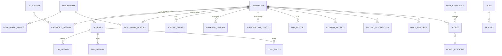

# quest-mf — Low-Level Design: Database

**Engine:** PostgreSQL 16 + TimescaleDB ≥ 2.14 · **Pooler:** PgBouncer ≥ 1.21 · **Cache/bus:** Redis 7
**Migrations:** Alembic (`backend/migrations/`) — the **only** way to change the schema.
**Parent:** [HLD](HLD.md)

---

## 1. Conventions

| Rule | Detail |
|---|---|
| Naming | `snake_case`; tables are plural nouns; PKs use `<entity>_id`; FKs have the same name as the referenced PK |
| Schemas | `auth`, `ref`, `market`, `analytics`, `scoring`, `backtest`, `ops` |
| Keys | `portfolio_id INT`, `scheme_code INT` (AMFI code), `category_id SMALLINT`, `window_id SMALLINT`, `benchmark_id SMALLINT` |
| Types | Business dates `DATE`; event times `TIMESTAMPTZ`; raw NAV `NUMERIC(18,6)`; derived metrics `REAL`; money in the calculator `NUMERIC(18,2)` |
| Nullability | `NOT NULL` by default; nullable only when "unknown" is meaningful |
| Time-series | Always a hypertable; every query **must** include a time predicate |
| Writes | Bulk = `COPY` into `*_staging` (UNLOGGED) → `MERGE`; never row-by-row in loops |
| Deletes | No hard deletes of source data; derived data is replaced per `data_snapshot_id` |
| Lineage | Derived tables carry `snapshot_id INT` → `ops.data_snapshots` |

## 2. Roles and access

```sql
-- One login role per service; least privilege.
CREATE ROLE svc_auth      LOGIN;  -- RW auth
CREATE ROLE svc_fund      LOGIN;  -- RW ref
CREATE ROLE svc_market    LOGIN;  -- RW market (API reads only), R ref
CREATE ROLE svc_analytics LOGIN;  -- R analytics, ref, market
CREATE ROLE svc_screener  LOGIN;  -- R scoring, ref
CREATE ROLE svc_backtest  LOGIN;  -- RW backtest.runs, R backtest.results, scoring
CREATE ROLE wkr_ingest    LOGIN;  -- RW market, ref, ops
CREATE ROLE wkr_compute   LOGIN;  -- R market, ref; RW analytics, scoring, ops
CREATE ROLE wkr_backtest  LOGIN;  -- R all; RW backtest
CREATE ROLE migrator      LOGIN;  -- DDL owner (used only by Alembic)
```

Read services connect to the **replica** via PgBouncer database alias `questmf_ro`. Writers use `questmf_rw`.

## 3. Entity-relationship overview



## 4. DDL

### 4.0 Extensions (first migration)

```sql
CREATE EXTENSION IF NOT EXISTS timescaledb;
CREATE EXTENSION IF NOT EXISTS btree_gist;        -- EXCLUDE constraints on (id, daterange)
CREATE EXTENSION IF NOT EXISTS pg_trgm;           -- fuzzy fund search
CREATE EXTENSION IF NOT EXISTS citext;            -- case-insensitive email
CREATE EXTENSION IF NOT EXISTS pg_stat_statements;
-- gen_random_uuid() is built in since PG13
```

### 4.1 `ops` — lineage and jobs

```sql
CREATE SCHEMA ops;

CREATE TABLE ops.data_snapshots (
    snapshot_id   SERIAL PRIMARY KEY,
    as_of_date    DATE        NOT NULL,
    created_at    TIMESTAMPTZ NOT NULL DEFAULT now(),
    git_sha       TEXT        NOT NULL,
    status        TEXT        NOT NULL CHECK (status IN ('BUILDING','PUBLISHED','FAILED')),
    notes         JSONB
);
CREATE INDEX ON ops.data_snapshots (as_of_date DESC);

CREATE TABLE ops.ingest_log (
    ingest_id     BIGSERIAL PRIMARY KEY,
    source        TEXT        NOT NULL,          -- AMFI_NAV, AMFI_TER, NSE_TRI, RBI_TBILL, MFAPI …
    source_url    TEXT        NOT NULL,
    business_date DATE,
    raw_sha256    BYTEA       NOT NULL,
    object_key    TEXT        NOT NULL,          -- OCI Object Storage key
    parser_ver    TEXT        NOT NULL,
    rows_in       INT         NOT NULL,
    rows_loaded   INT         NOT NULL,
    rows_rejected INT         NOT NULL,
    retrieved_at  TIMESTAMPTZ NOT NULL DEFAULT now(),
    UNIQUE (source, raw_sha256)
);

CREATE TABLE ops.dq_issues (
    issue_id      BIGSERIAL PRIMARY KEY,
    ingest_id     BIGINT REFERENCES ops.ingest_log,
    check_name    TEXT NOT NULL,
    severity      TEXT NOT NULL CHECK (severity IN ('INFO','WARN','BLOCK')),
    entity_key    TEXT NOT NULL,
    details       JSONB,
    resolved      BOOLEAN NOT NULL DEFAULT false,
    created_at    TIMESTAMPTZ NOT NULL DEFAULT now()
);
```

### 4.2 `ref` — reference data (owner: fund-service)

```sql
CREATE SCHEMA ref;

CREATE TABLE ref.amcs (
    amc_id     SMALLSERIAL PRIMARY KEY,
    name       TEXT NOT NULL UNIQUE
);

CREATE TABLE ref.categories (
    category_id SMALLSERIAL PRIMARY KEY,
    code        TEXT NOT NULL UNIQUE,          -- 'EQ_SMALL_CAP'
    label       TEXT NOT NULL,                 -- 'Small Cap'
    asset_class TEXT NOT NULL,                 -- EQUITY / DEBT / HYBRID / OTHER
    ref_benchmark_id SMALLINT                  -- category reference TRI
);

CREATE TABLE ref.benchmarks (
    benchmark_id SMALLSERIAL PRIMARY KEY,
    code         TEXT NOT NULL UNIQUE,         -- 'NIFTY_SMALLCAP_250_TRI'
    label        TEXT NOT NULL,
    provider     TEXT NOT NULL,                -- NSE / BSE
    is_tri       BOOLEAN NOT NULL
);

CREATE TABLE ref.portfolios (
    portfolio_id  SERIAL PRIMARY KEY,
    display_name  TEXT NOT NULL,
    amc_id        SMALLINT NOT NULL REFERENCES ref.amcs,
    launch_date   DATE,
    closed_date   DATE,
    close_reason  TEXT,                        -- MERGED / WOUND_UP / NULL
    search_tsv    TSVECTOR GENERATED ALWAYS AS (to_tsvector('simple', display_name)) STORED
);
CREATE INDEX portfolios_search_gin ON ref.portfolios USING gin (search_tsv);
CREATE INDEX portfolios_name_trgm ON ref.portfolios USING gin (display_name gin_trgm_ops);

CREATE TABLE ref.schemes (
    scheme_code   INT PRIMARY KEY,             -- AMFI scheme code
    portfolio_id  INT  NOT NULL REFERENCES ref.portfolios,
    isin_payout   TEXT,
    isin_reinvest TEXT,
    scheme_name   TEXT NOT NULL,
    plan          TEXT NOT NULL CHECK (plan IN ('DIRECT','REGULAR')),
    option        TEXT NOT NULL CHECK (option IN ('GROWTH','IDCW','BONUS')),
    inception_date DATE,
    status        TEXT NOT NULL CHECK (status IN ('ACTIVE','CLOSED')),
    is_canonical  BOOLEAN NOT NULL DEFAULT false,
    CONSTRAINT canonical_is_growth CHECK (NOT is_canonical OR option = 'GROWTH')
);
CREATE UNIQUE INDEX one_canonical_per_portfolio
    ON ref.schemes (portfolio_id) WHERE is_canonical;

-- Point-in-time dimension pattern (used by all *_history tables)
CREATE TABLE ref.category_history (
    portfolio_id  INT      NOT NULL REFERENCES ref.portfolios,
    valid         DATERANGE NOT NULL,
    category_id   SMALLINT NOT NULL REFERENCES ref.categories,
    mapping_confidence REAL NOT NULL DEFAULT 1.0,
    source_url    TEXT,
    EXCLUDE USING gist (portfolio_id WITH =, valid WITH &&)   -- no overlapping validity
);

CREATE TABLE ref.benchmark_history (
    portfolio_id INT NOT NULL REFERENCES ref.portfolios,
    valid        DATERANGE NOT NULL,
    benchmark_id SMALLINT NOT NULL REFERENCES ref.benchmarks,
    tier         SMALLINT NOT NULL DEFAULT 1,
    source_url   TEXT,
    EXCLUDE USING gist (portfolio_id WITH =, tier WITH =, valid WITH &&)
);

CREATE TABLE ref.subscription_status (
    portfolio_id INT NOT NULL REFERENCES ref.portfolios,
    valid        DATERANGE NOT NULL,
    status       TEXT NOT NULL CHECK (status IN ('OPEN','LUMPSUM_RESTRICTED','SIP_ONLY','SUSPENDED')),
    note         TEXT,
    source_url   TEXT,
    EXCLUDE USING gist (portfolio_id WITH =, valid WITH &&)
);

CREATE TABLE ref.manager_history (
    portfolio_id INT  NOT NULL REFERENCES ref.portfolios,
    manager_name TEXT NOT NULL,
    valid        DATERANGE NOT NULL,
    source_url   TEXT
);

CREATE TABLE ref.scheme_events (
    event_id     BIGSERIAL PRIMARY KEY,
    portfolio_id INT  NOT NULL REFERENCES ref.portfolios,
    event_date   DATE NOT NULL,
    event_type   TEXT NOT NULL CHECK (event_type IN ('MERGER','RENAME','CATEGORY_CHANGE',
                   'BENCHMARK_CHANGE','MANAGER_CHANGE','SEGREGATION','WIND_UP','NAV_RESTATEMENT')),
    details      JSONB NOT NULL DEFAULT '{}',
    source_url   TEXT
);
CREATE INDEX ON ref.scheme_events (portfolio_id, event_date DESC);

CREATE TABLE ref.ter_history (
    scheme_code    INT  NOT NULL REFERENCES ref.schemes,
    effective_date DATE NOT NULL,
    ter            REAL NOT NULL,
    base_ter       REAL,
    source_url     TEXT,
    PRIMARY KEY (scheme_code, effective_date)
);

CREATE TABLE ref.load_rules (
    scheme_code    INT  NOT NULL REFERENCES ref.schemes,
    valid          DATERANGE NOT NULL,
    exit_load_rate REAL,              -- NULL = unknown
    exit_load_days SMALLINT,
    rule_text      TEXT NOT NULL,
    source_url     TEXT,
    EXCLUDE USING gist (scheme_code WITH =, valid WITH &&)
);

CREATE TABLE ref.aum_history (
    portfolio_id INT  NOT NULL REFERENCES ref.portfolios,
    month_end    DATE NOT NULL,
    aum_cr       REAL NOT NULL,
    PRIMARY KEY (portfolio_id, month_end)
);

CREATE TABLE ref.tax_rules (
    asset_class         TEXT NOT NULL,
    valid               DATERANGE NOT NULL,
    stcg_rate           REAL NOT NULL,
    ltcg_rate           REAL NOT NULL,
    ltcg_exemption_inr  NUMERIC(18,2) NOT NULL,
    lt_holding_days     SMALLINT NOT NULL,
    stamp_duty_rate     REAL NOT NULL,
    stt_redeem_rate     REAL NOT NULL,
    source_url          TEXT NOT NULL,
    EXCLUDE USING gist (asset_class WITH =, valid WITH &&)
);

CREATE TABLE ref.windows (
    window_id SMALLINT PRIMARY KEY,
    code      TEXT NOT NULL UNIQUE,     -- CAL_1M, CAL_3M, OBS_63 …
    kind      TEXT NOT NULL CHECK (kind IN ('CAL_MONTH','CAL_DAY','OBS')),
    size      SMALLINT NOT NULL         -- months | days | observations
);
```

**Point-in-time lookup pattern** (used everywhere):

```sql
SELECT category_id FROM ref.category_history
WHERE portfolio_id = $1 AND valid @> $2::date;
```

### 4.3 `market` — raw time series (owner: ingestion-worker; read API: market-data-service)

```sql
CREATE SCHEMA market;

CREATE TABLE market.nav_history (
    scheme_code  INT           NOT NULL,
    nav_date     DATE          NOT NULL,
    nav          NUMERIC(18,6) NOT NULL CHECK (nav > 0),
    ingest_id    BIGINT        NOT NULL,
    revision     SMALLINT      NOT NULL DEFAULT 0,
    PRIMARY KEY (scheme_code, nav_date)
);
SELECT create_hypertable('market.nav_history', by_range('nav_date', INTERVAL '1 year'));
ALTER TABLE market.nav_history SET (
    timescaledb.compress,
    timescaledb.compress_segmentby = 'scheme_code',
    timescaledb.compress_orderby   = 'nav_date DESC'
);
SELECT add_compression_policy('market.nav_history', INTERVAL '120 days');

CREATE UNLOGGED TABLE market.nav_staging (LIKE market.nav_history INCLUDING DEFAULTS);

-- Restatements keep the prior value
CREATE TABLE market.nav_revisions (
    scheme_code INT NOT NULL, nav_date DATE NOT NULL,
    old_nav NUMERIC(18,6) NOT NULL, new_nav NUMERIC(18,6) NOT NULL,
    ingest_id BIGINT NOT NULL, revised_at TIMESTAMPTZ NOT NULL DEFAULT now()
);

CREATE TABLE market.benchmark_values (
    benchmark_id SMALLINT NOT NULL,
    value_date   DATE     NOT NULL,
    value        NUMERIC(18,4) NOT NULL,
    ingest_id    BIGINT   NOT NULL,
    PRIMARY KEY (benchmark_id, value_date)
);
SELECT create_hypertable('market.benchmark_values', by_range('value_date', INTERVAL '5 years'));

CREATE TABLE market.risk_free (
    series     TEXT NOT NULL,          -- TBILL_91D
    rate_date  DATE NOT NULL,
    annual_yield REAL NOT NULL,
    PRIMARY KEY (series, rate_date)
);

-- Monthly continuous aggregate for long-range charts
CREATE MATERIALIZED VIEW market.nav_monthly
WITH (timescaledb.continuous) AS
SELECT scheme_code,
       time_bucket(INTERVAL '1 month', nav_date) AS month,
       last(nav, nav_date)  AS nav_close,
       max(nav)             AS nav_high,
       min(nav)             AS nav_low
FROM market.nav_history
GROUP BY scheme_code, month;
SELECT add_continuous_aggregate_policy('market.nav_monthly',
    start_offset => INTERVAL '3 months', end_offset => INTERVAL '1 day',
    schedule_interval => INTERVAL '1 day');
```

**Load procedure** (idempotent):

```sql
-- 1) COPY into market.nav_staging (binary, via asyncpg)
-- 2) record revisions
INSERT INTO market.nav_revisions (scheme_code, nav_date, old_nav, new_nav, ingest_id)
SELECT h.scheme_code, h.nav_date, h.nav, s.nav, s.ingest_id
FROM market.nav_staging s JOIN market.nav_history h USING (scheme_code, nav_date)
WHERE h.nav <> s.nav;
-- 3) upsert
INSERT INTO market.nav_history AS h (scheme_code, nav_date, nav, ingest_id)
SELECT scheme_code, nav_date, nav, ingest_id FROM market.nav_staging
ON CONFLICT (scheme_code, nav_date) DO UPDATE
   SET nav = EXCLUDED.nav, ingest_id = EXCLUDED.ingest_id, revision = h.revision + 1
   WHERE h.nav IS DISTINCT FROM EXCLUDED.nav;
TRUNCATE market.nav_staging;
```

### 4.4 `analytics` — derived features (writer: compute-worker)

```sql
CREATE SCHEMA analytics;

CREATE TABLE analytics.rolling_metrics (
    portfolio_id     INT      NOT NULL,
    window_id        SMALLINT NOT NULL,
    end_date         DATE     NOT NULL,
    start_date       DATE     NOT NULL,
    n_obs            SMALLINT NOT NULL,
    ret              REAL NOT NULL,
    log_ret          REAL NOT NULL,
    bench_ret        REAL,
    active_ret       REAL,
    excess_ret       REAL,
    max_dd           REAL,
    vol_ann          REAL,
    downside_dev_ann REAL,
    beta             REAL,
    tracking_error   REAL,
    worst_day        REAL,
    best_day         REAL,
    neg_day_pct      REAL,
    flags            SMALLINT NOT NULL DEFAULT 0,   -- bitmask: 1=has_gap 2=proxy_series 4=bench_pri
    staleness_days   SMALLINT NOT NULL DEFAULT 0,
    snapshot_id      INT      NOT NULL,
    PRIMARY KEY (portfolio_id, window_id, end_date)
);
SELECT create_hypertable('analytics.rolling_metrics', by_range('end_date', INTERVAL '1 year'));
ALTER TABLE analytics.rolling_metrics SET (
    timescaledb.compress,
    timescaledb.compress_segmentby = 'portfolio_id, window_id',
    timescaledb.compress_orderby   = 'end_date DESC'
);
SELECT add_compression_policy('analytics.rolling_metrics', INTERVAL '90 days');

CREATE TABLE analytics.rolling_distribution (
    portfolio_id  INT      NOT NULL,
    window_id     SMALLINT NOT NULL,
    variant       SMALLINT NOT NULL,     -- 1=EXPANDING 2=TRAILING_5Y
    as_of_date    DATE     NOT NULL,
    mean REAL, median REAL, std REAL, min REAL, max REAL,
    p10 REAL, p25 REAL, p75 REAL, p90 REAL,
    positive_pct REAL, bench_beat_pct REAL,
    median_active REAL, p10_active REAL,
    median_max_dd REAL,
    effective_n   REAL NOT NULL,
    confidence    SMALLINT NOT NULL,     -- 0=INSUFFICIENT 1=LOW 2=OK
    snapshot_id   INT NOT NULL,
    PRIMARY KEY (portfolio_id, window_id, variant, as_of_date)
);
SELECT create_hypertable('analytics.rolling_distribution', by_range('as_of_date', INTERVAL '1 year'));
ALTER TABLE analytics.rolling_distribution SET (
    timescaledb.compress,
    timescaledb.compress_segmentby = 'portfolio_id, window_id, variant',
    timescaledb.compress_orderby   = 'as_of_date DESC'
);
SELECT add_compression_policy('analytics.rolling_distribution', INTERVAL '90 days');

CREATE TABLE analytics.daily_features (
    portfolio_id INT  NOT NULL,
    feature_date DATE NOT NULL,
    ret_1m REAL, ret_3m REAL, ret_6m REAL, ret_1y REAL,
    cagr_3y REAL, cagr_5y REAL,
    shp_3m REAL, peer_pct_1m REAL, peer_pct_3m REAL, peer_pct_6m REAL,
    sharpe_1y REAL, sortino_1y REAL, ir_3y REAL, mdd_3y REAL,
    rsi14 REAL, sma20 REAL, sma50 REAL, sma200 REAL,
    mom_accel REAL, mom_12_1 REAL, rs_slope REAL,
    snapshot_id INT NOT NULL,
    PRIMARY KEY (portfolio_id, feature_date)
);
SELECT create_hypertable('analytics.daily_features', by_range('feature_date', INTERVAL '2 years'));

-- Hot, denormalised, latest-only: one row per portfolio (fund page header)
CREATE TABLE analytics.fund_summary (
    portfolio_id INT PRIMARY KEY,
    as_of_date   DATE NOT NULL,
    payload      JSONB NOT NULL,        -- pre-shaped for the fund page
    snapshot_id  INT NOT NULL
);
```

### 4.5 `scoring` — scores and screener snapshot (writer: compute-worker; reader: screener-service)

```sql
CREATE SCHEMA scoring;

CREATE TABLE scoring.model_versions (
    model_version TEXT PRIMARY KEY,         -- 'v1_baseline'
    config        JSONB NOT NULL,           -- weights, features
    created_at    TIMESTAMPTZ NOT NULL DEFAULT now(),
    is_default    BOOLEAN NOT NULL DEFAULT false
);

CREATE TABLE scoring.scores (
    portfolio_id  INT  NOT NULL,
    as_of_date    DATE NOT NULL,
    model_version TEXT NOT NULL,
    momentum REAL, persistence REAL, lt_quality REAL, risk REAL, cost REAL,
    composite     REAL,
    confidence    SMALLINT NOT NULL,
    quadrant      SMALLINT,                 -- 1..4 (2×2 matrix)
    flags         INT NOT NULL DEFAULT 0,
    snapshot_id   INT NOT NULL,
    PRIMARY KEY (portfolio_id, model_version, as_of_date)
);
SELECT create_hypertable('scoring.scores', by_range('as_of_date', INTERVAL '1 year'));

-- Denormalised, request-shaped. Monthly range partitions, hot = latest.
CREATE TABLE scoring.screener_snapshot (
    as_of_date    DATE     NOT NULL,
    model_version TEXT     NOT NULL,
    category_id   SMALLINT NOT NULL,
    portfolio_id  INT      NOT NULL,
    fund_name     TEXT     NOT NULL,
    amc           TEXT     NOT NULL,
    ret_1m REAL, ret_3m REAL, ret_6m REAL, ret_1y REAL, cagr_3y REAL,
    shp_3m REAL, peer_pct_3m REAL, alpha_3m REAL, ir_3y REAL, mdd_3y REAL,
    ter REAL, exit_load_rate REAL, exit_load_days SMALLINT, aum_cr REAL,
    composite REAL, confidence SMALLINT, quadrant SMALLINT,
    flags INT NOT NULL,
    investable BOOLEAN NOT NULL,
    PRIMARY KEY (as_of_date, model_version, category_id, portfolio_id)
) PARTITION BY RANGE (as_of_date);
-- covering index for the default sort
CREATE INDEX screener_default_sort ON scoring.screener_snapshot
    (as_of_date, model_version, category_id, composite DESC NULLS LAST)
    INCLUDE (portfolio_id, fund_name, ret_1m, ret_3m, ret_1y, shp_3m, peer_pct_3m,
             alpha_3m, mdd_3y, ter, confidence, flags, investable);
-- partitions created monthly by compute-worker (pg_partman optional)

CREATE TABLE scoring.latest (
    model_version TEXT PRIMARY KEY,
    as_of_date    DATE NOT NULL,
    snapshot_id   INT  NOT NULL,
    published_at  TIMESTAMPTZ NOT NULL
);
```

### 4.6 `backtest` — runs and results

```sql
CREATE SCHEMA backtest;

CREATE TABLE backtest.runs (
    run_id         BIGSERIAL PRIMARY KEY,
    created_by     UUID NOT NULL,
    model_version  TEXT NOT NULL,
    config         JSONB NOT NULL,
    idempotency_key TEXT UNIQUE,
    status         TEXT NOT NULL CHECK (status IN ('QUEUED','RUNNING','DONE','FAILED','CANCELLED','ARCHIVED')),
    progress_pct   REAL NOT NULL DEFAULT 0,
    summary        JSONB,                  -- IC stats, CAGR, Sharpe, MDD, net vs gross …
    snapshot_id    INT NOT NULL,
    git_sha        TEXT NOT NULL,
    archive_key    TEXT,                   -- object storage parquet when archived
    created_at     TIMESTAMPTZ NOT NULL DEFAULT now(),
    finished_at    TIMESTAMPTZ
);
CREATE INDEX ON backtest.runs USING brin (created_at);

CREATE TABLE backtest.results (
    run_id         BIGINT   NOT NULL,
    decision_date  DATE     NOT NULL,
    portfolio_id   INT      NOT NULL,
    bucket         SMALLINT NOT NULL,      -- quintile / top-k marker
    weight         REAL     NOT NULL,
    score          REAL,
    fwd_1m REAL, fwd_3m REAL, fwd_6m REAL, fwd_12m REAL,
    fwd_3m_net_load REAL, fwd_3m_net_tax REAL,
    bench_fwd_3m REAL
) PARTITION BY LIST (run_id);
-- per run: CREATE TABLE backtest.results_r123 PARTITION OF backtest.results FOR VALUES IN (123);
--          then (after load) CREATE INDEX ON backtest.results_r123 (decision_date, bucket);

CREATE TABLE backtest.run_series (           -- equity curve / IC series (small)
    run_id   BIGINT NOT NULL REFERENCES backtest.runs,
    series   TEXT   NOT NULL,                -- EQUITY_GROSS, EQUITY_NET, IC_3M …
    d        DATE   NOT NULL,
    v        REAL   NOT NULL,
    PRIMARY KEY (run_id, series, d)
);
```

**Retention:** keep the last 100 `DONE` runs hot. Older runs are exported to Parquet (`backtests/run_id=…/`), `archive_key` is set, the partition is dropped, and the status becomes `ARCHIVED`. Archived results are served from Parquet via DuckDB in backtest-service on demand.

### 4.7 `auth`

```sql
CREATE SCHEMA auth;
CREATE TABLE auth.users (
    user_id       UUID PRIMARY KEY DEFAULT gen_random_uuid(),
    email         CITEXT NOT NULL UNIQUE,
    password_hash TEXT   NOT NULL,           -- argon2id
    role          TEXT   NOT NULL CHECK (role IN ('viewer','analyst','admin')),
    is_active     BOOLEAN NOT NULL DEFAULT true,
    created_at    TIMESTAMPTZ NOT NULL DEFAULT now()
);
CREATE TABLE auth.refresh_tokens (
    token_hash BYTEA PRIMARY KEY,
    user_id    UUID NOT NULL REFERENCES auth.users,
    expires_at TIMESTAMPTZ NOT NULL,
    revoked    BOOLEAN NOT NULL DEFAULT false
);
CREATE TABLE auth.audit_log (
    id BIGSERIAL PRIMARY KEY, user_id UUID, action TEXT NOT NULL,
    meta JSONB, at TIMESTAMPTZ NOT NULL DEFAULT now()
);
```

## 5. Canonical queries (must stay index-backed)

| # | Service | Query | Expected plan |
|---|---|---|---|
| Q1 | screener | `SELECT … FROM scoring.screener_snapshot WHERE as_of_date=$1 AND model_version=$2 AND category_id=$3 ORDER BY composite DESC NULLS LAST LIMIT 200` | Index-only scan on `screener_default_sort`, single partition |
| Q2 | market | `SELECT nav_date, nav FROM market.nav_history WHERE scheme_code=$1 AND nav_date BETWEEN $2 AND $3 ORDER BY nav_date` | Chunk exclusion + PK / compressed segment |
| Q3 | market | `SELECT month, nav_close FROM market.nav_monthly WHERE scheme_code=$1` | Continuous aggregate |
| Q4 | analytics | `SELECT end_date, ret, active_ret, max_dd FROM analytics.rolling_metrics WHERE portfolio_id=$1 AND window_id=$2 AND end_date >= $3 ORDER BY end_date` | Segment-by filter on compressed chunks |
| Q5 | analytics | `SELECT * FROM analytics.rolling_distribution WHERE portfolio_id=$1 AND window_id=$2 AND variant=1 ORDER BY as_of_date DESC LIMIT 1` | PK, latest chunk |
| Q6 | fund | `SELECT portfolio_id, display_name FROM ref.portfolios WHERE display_name % $1 ORDER BY similarity(display_name,$1) DESC LIMIT 10` | trigram GIN |
| Q7 | backtest | `SELECT d, v FROM backtest.run_series WHERE run_id=$1 AND series=$2 ORDER BY d` | PK |

CI runs `EXPLAIN (FORMAT JSON)` on Q1–Q7 against the fixture DB and fails if a `Seq Scan` appears on a hypertable or a partitioned table.

## 6. PostgreSQL tuning (data VM: 8 OCPU / 64 GB)

```ini
shared_buffers = 16GB
effective_cache_size = 48GB
work_mem = 64MB
maintenance_work_mem = 2GB
max_connections = 200            # PgBouncer fronts clients
max_worker_processes = 24
max_parallel_workers = 8
max_parallel_workers_per_gather = 4
wal_level = replica
max_wal_size = 16GB
checkpoint_timeout = 15min
random_page_cost = 1.1           # block volume SSD
effective_io_concurrency = 200
jit = off                        # short OLTP-style reads
timescaledb.max_background_workers = 8
shared_preload_libraries = 'timescaledb,pg_stat_statements'
```

**PgBouncer:** `pool_mode = transaction`, `default_pool_size = 40`, `max_client_conn = 2000`, `max_prepared_statements = 200`.

## 7. Redis design

| Key / stream | Type | TTL | Purpose |
|---|---|---|---|
| `ver:scores` | string (int) | none | Bumped after every publish |
| `ver:analytics` | string (int) | none | Same, for analytics caches |
| `scr:{ver}:{sha1(query)}` | string (bytes) | 24 h | Screener response |
| `fund:{ver}:{portfolio_id}:summary` | string (bytes) | 24 h | Fund header |
| `series:{ver}:{kind}:{id}:{window}:{range}:{pts}` | string (bytes) | 24 h | Downsampled series |
| `search:{prefix}` | string (bytes) | 1 h | Typeahead |
| `rl:{route}:{subject}` | counter | 60 s | App-level rate limit (backup to Nginx) |
| `lock:scheduler` | string | 30 s (renewed) | Leader election |
| `jobs.ingest`, `nav.ingested`, `scores.published`, `backtest.requested`, `backtest.progress`, `backtest.completed` | stream | `MAXLEN ~ 100000` | Event bus |
| `*.dlq` | stream | `MAXLEN ~ 10000` | Dead letters |

Config: `maxmemory 6gb`, `maxmemory-policy allkeys-lru` (for the cache DB 0). Streams go in **DB 1** with `noeviction`, or better in a separate Redis instance in prod, so that LRU never evicts events. AOF `everysec` is on for the streams instance.

## 8. Backups and recovery

| What | How | RPO / RTO |
|---|---|---|
| Postgres | pgBackRest → OCI Object Storage (S3-compatible API); full weekly, diff daily, WAL continuous | RPO ≤ 5 min · RTO ≤ 1 h |
| Replica | streaming replication; promotion runbook | RTO ≤ 10 min |
| Raw payloads | Object Storage with versioning; lifecycle to Archive tier after 1 year | — |
| Redis cache | not backed up (rebuildable) | — |
| Redis streams | AOF + RDB daily | RPO ≤ 1 s |

Restore drills run quarterly: restore to staging and run the Q1–Q7 checks.
